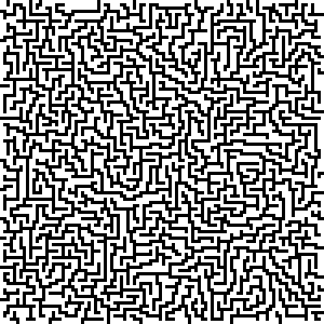

# Quick & Beautiful

Programming exercises for beginners that I collected and prepared.

Repository contains overview readme file that you are reading and folders with materials for each exercise. Each folder contains code in stages from simplest one to a finished project. Some folder contain also additional data like example data ready for processing.

Tutorial materials for work with a beginner, mostly code in stages from scratch to a completed work.

I am searching for exercises that can be solved with a simple code and give properly impressive results. Results that may be
shown to friend/mother/brother/daughter and will impress them.

Code in this repository is a mix of material already used and tested, ideas for a future, work in progress and notes.

Note that materials presented here are only part of what I am using. Programs are likely to be more useful as inspiration than in a direct use.

# Exercises

All images below were created using code from this repository.

## Hello world

Standard hello world example.

## Mandelbrot visualisation

[code](01-mandelbrot)

Generation of beautiful [Mandelbrot fractal](https://en.wikipedia.org/wiki/Mandelbrot_set). Demonstrates one of cases where vast computing power of a computer allows to achieve results unfeasible with human computing power due to cost differences alone.

## Image generator

[code](02-image-generator-making-dwarf-village)

Making an image out of simple shapes. For example group of dwarves in from of their home. Excellent situation to demonstrate why using functions to reuse code is useful.

## Lists and simple statistics

[code](03-lists-and-simple-statistics)

Introduction to lists - very basic level (showing list, looping through a list).

## Splitting text into words

[code](04-splitting-text-into-words)

Building function that will split text into words.

## Book statistics

[code](05-book-statistics)

Loading entire book and outputting statistics. Doing in minutes what before computers needed [years](https://en.wikipedia.org/wiki/Concordance_(publishing)).

Book texts are in public domain and were obtained from:

[Project Gutenberg](http://www.gutenberg.org/)

* A Christmas Carol in Prose; Being a Ghost Story of Christmas by Charles Dickens
* Moby Dick; or The Whale, by Herman Melville

[Wikiźródła](https://pl.wikisource.org/)

* Ania z Wyspy, Lucy Maud Montgomery, przełożył Andrzej Magórski

[Wolne Lektury](https://wolnelektury.pl/)

* Anhelli, Juliusz Słowacki

Short texts covered by fair use:

* "Torched the haystack. Found the needle." by Newtonswig
* "Voyager still transmitted, but Earth didn’t." by ErasedCitizen

[Unifont font file](http://unifoundry.com/unifont/index.html) is embedded into this document under its font embedding exception.

[SpaceGrotesk font files](https://github.com/floriankarsten/space-grotesk) are OFL-1.1 licensed and were found on [beautiful-web-type project](https://github.com/ubuwaits/beautiful-web-type).

## Maze generator

[code](06-maze-generation)

Maze generation, includes powerful example why classes are useful.

## Sierpiński's carpet

[code](17-Sierpiński's-carpet)

More complicated case of recursion.

# Beyond simple programs

Note that simple programs like listed here are a great first step. But to really learn programming one needs also to be able to dive in large programs made by other people, to properly document changes. Basic skills like Git were not even mentioned here and are absolute necessity even for a hobbyist.

# Bonus

Materials showing interesting cases where programming is necessary:

* [7 Minutes of Terror: Curiosity Rover's Risky Mars Landing](https://www.youtube.com/watch?v=h2I8AoB1xgU) (bonus: [landing video](https://www.youtube.com/watch?v=svUJdzMHwmM) + [Curiosity rover descending on a parachute, photo made by Mars Reconnaissance Orbiter](https://www.jpl.nasa.gov/spaceimages/details.php?id=PIA15978))

# Dependency install

Do install dependencies run

`pip3 install -r requirements.txt`

If pygame install fails with `Unable to run "sdl-config". Please make sure a development version of SDL is installed.` it is likely that you need to run also `sudo apt install libsdl1.2-dev`

If Pygame complains about missing dependences you may want to install them using `sudo apt-get install python3-dev libsdl-image1.2-dev libsdl-mixer1.2-dev libsdl-ttf2.0-dev  libsdl1.2-dev libsmpeg-dev python-numpy subversion libportmidi-dev ffmpeg libswscale-dev libavformat-dev libavcodec-dev` (if on Ubuntu/Debian).

# Maintenance commands

## Reformat code to follow Python coding standards

`autopep8 --in-place --recursive .`

[PEP 8 -- Style Guide for Python Code](https://www.python.org/dev/peps/pep-0008/)

## Detect code style issues

`pylint **/*.py --include-naming-hint=y --variable-rgx="^[a-z][a-z0-9]*((_[a-z0-9]+)*)?$" --argument-rgx="^[a-z][a-z0-9]*((_[a-z0-9]+)*)?$" --disable=C0103,R0801`

It includes a workaround for bug [#2018](https://github.com/PyCQA/pylint/issues/2018) and disables rule `C0103` with many false positives (too eager to convert variables into constants).

Rule `R0801` is also disabled as it is not working properly due to specific repository format (many versions of the same code).

### Version without minor complaints

`pylint **/*.py --include-naming-hint=y --variable-rgx=^[a-z][a-z0-9]*((_[a-z0-9]+)*)?$ --argument-rgx=^[a-z][a-z0-9]*((_[a-z0-9]+)*)?$ --disable=C0103,R0801,C0111,W0621`

Rule `C0111` requesting docstrings is disabled, the same with `W0621` complaining about defining some variables not within functions. Two rules disabled due to false positives are mentioned in the section above.

## Run all Python scripts in one folder

`find . -maxdepth 1 -type f -name "*.py" -exec python3 {} \;`

Command based on one by [Jim Lewis](https://stackoverflow.com/a/10523492/4130619)

# Skipped concepts

Some more advanced techniques were ignored in code presented here, despite that code may be a bit cleaner.

For example `if __name__ == '__main__'` is skipped in most of examples.

Using it makes sense in the production code written and improved in the future by professional programmers. But code here is intended to be used with beginners so complicated concepts with limited use are skipped.

Skipped concepts/techniques may be listed in `SKIPPED.md` file or as a comment in the source code.

# Similar projects

There are some similar projects with materials and ideas on the topic of teaching programming to beginners with interesting miniprojects.

Some of them have extensive explanations making the useful on their own for the beginner.

Note that it is not a list of tutorials - I am rather looking for lists of interesting project ideas. It is necessary that these projects are doable by beginners (with a help from a tutor or on their own) and give impressive results.

It may be in any programming, not only Python (though I think that Python is a great first programming language).

* [Automate the Boring Stuff with Python](https://automatetheboringstuff.com/)
* [Let's Learn Python!](http://www.letslearnpython.com/)
* [Making Games with Python & Pygame](http://inventwithpython.com/pygame/)

If something is missing on this list, [let me know](https://github.com/matkoniecz/quick-beautiful/issues/new).
